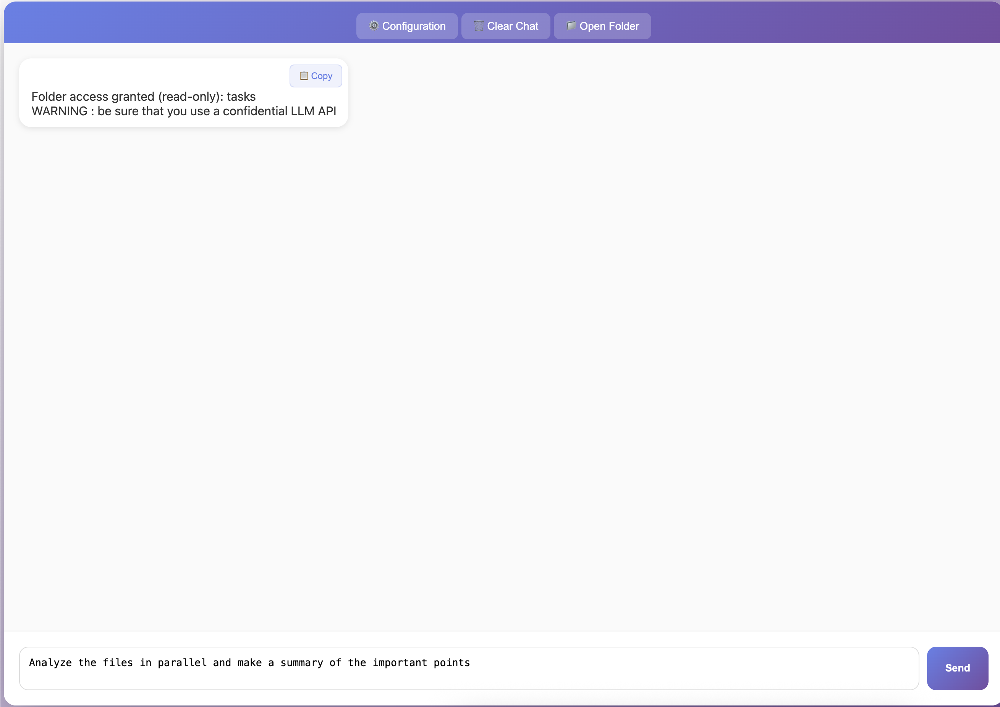

# Less is FORe

### The "Zero-Install" Agentic RAG in a single HTML file.

**[🚀 Try the Live Demo](https://for-sight-ai.github.io/LessIsFORe/LessIsFore.html)**

---

## 📖 The Problem: Corporate "Software Walls"

In many corporate environments, you have a local LLM backend (like Ollama or a private API) but **zero rights** to install Python, Node.js, or Docker. You are stuck with a browser and your documents.

## 💡 The Solution: A Portable AI Gateway

**Less is FORe** is a minimalist, agentic AI assistant contained entirely within **one single `.html` file**.

* **No installation.**
* **No environment setup.**
* **No admin rights required.**

Just download it, open it in Chrome/Edge, and start chatting with your local folders.

---

## ✨ Key Features

* **📂 Native File Access:** Uses the *File System Access API* to read your local directories (read-only) without any backend processing.
* **📄 Multi-Format:** Built-in JS parsers for `.pdf`, `.docx`, `.pptx`, and text files.
* **🤖 Agentic Intelligence:** Unlike basic search, the built-in loop can list files, grep content, and perform parallel analysis across your data.
* **🔒 Audit-Ready:** 100% transparent. A security officer can audit the entire source code in 2 minutes. No hidden "phone home" calls.

---

## 🛠️ Getting Started

1. **Download** the `LessIsFORe.html` file.
2. **Open** it in a modern browser (Chrome, Edge, or Brave).
3. **Connect** your OpenAI-compatible API (Ollama, vLLM, OpenAI).
4. **Select** a folder and start querying.

### Quick Demo



---

## 🛡️ Security & Privacy

* **Sandbox-Powered:** Runs within the browser's native sandbox.
* **Privacy-First:** Your documents never leave your machine except to go to the LLM API endpoint *you* provide.
* **Ephemeral:** No registry keys, no "droppings", no persistent local storage of your documents.

---

## 🔧 Troubleshooting

### CORS Issues with Local APIs

If you're using **Ollama** or another local API and getting CORS (Cross-Origin Resource Sharing) errors in the browser console, you need to configure the API to allow browser requests:

**For Ollama:**
```bash
export OLLAMA_ORIGINS="*"
ollama serve
```

Then restart Ollama and try again. This is the most common issue when using a pure HTML application with a local backend.

---

## 🔗 LLM Backend & Proxying

This file acts as the **Frontend**. It requires an OpenAI-compatible API to function.

For a simple, configurable proxy to handle your LLM backends, CORS managemet compatible, we recommend looking at the **MunchFORsen** project. 
It pairs perfectly with this UI to provide a full-stack, corporate-compatible AI experience.

---

## Acknowledgement

This project received funding from the French "IA Cluster" program within the Artificial and Natural Intelligence Toulouse Institute (ANITI) and from the "France 2030" program within IRT Saint Exupery. The authors gratefully acknowledge the support of the FOR projects.

## 📜 License

This project is open source, under the MIT license.
